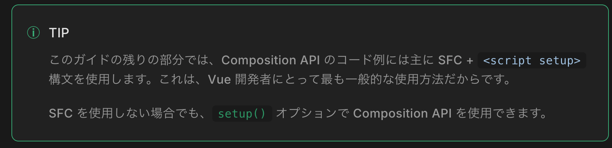
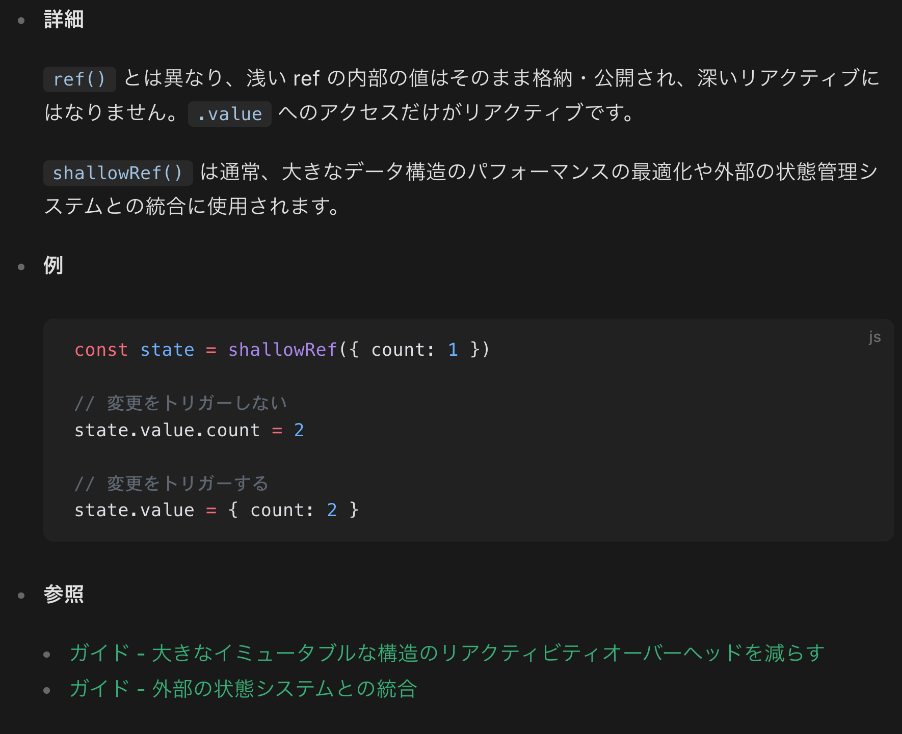

# リアクティビティーの基礎

## リアクティブな状態を宣言する

### ref()
```js
import { ref } from 'vue'

const count = ref(0)
```

```js
const count = ref(0)

console.log(count) // { value: 0 }
console.log(count.value) // 0

count.value++
console.log(count.value) // 1
```

- コンポーネントのテンプレート内で ref にアクセスするには、下記に示すように、コンポーネントの setup() 関数で宣言し、それを返します:

```js
import { ref } from 'vue'

export default {
  // `setup` は、Composition API 専用の特別なフックです。
  setup() {
    const count = ref(0)

    // ref をテンプレートに公開します
    return {
      count
    }
  }
}

// observe from html
<div>{{ count }}</div>
```

- テンプレート内で ref を使用する際、.value をつける必要はないことに注意してください。便利なように、ref はテンプレート内で使用されると自動的にアンラップされます（いくつかの注意点があります）。


- イベントハンドラーで直接 ref を変更することもできます:
```js
<button @click="count++">
  {{ count }}
</button>
```
- ⚠️この処理はちゃんと外部に切り出すべきだと思う


- より複雑なロジックの場合、同じスコープで ref を変更する関数を宣言し、状態とともにメソッドとして公開できます:

```js
import { ref } from 'vue'

export default {
  setup() {
    const count = ref(0)

    function increment() {
      // JavaScript 内では .value が必要
      count.value++
    }

    // 関数も公開することを忘れないでください。
    return {
      count,
      increment
    }
  }
}
```

- 公開されたメソッドは、イベントハンドラーとして使用できます:

```html
<button @click="increment">
  {{ count }}
</button>
```

### <script setup>

- setup() で状態やメソッドを手動で公開するのは冗長になりがちです。幸い、単一ファイルコンポーネント（SFC） を使用すれば、これを避けられます。- <script setup> によって使い方を簡略化できます:

⚠️これがテンプレート構文と App.vue で見た一般的な書き方だね
```vue
<script setup>
import { ref } from 'vue'

const count = ref(0)

function increment() {
  count.value++
}
</script>

<template>
  <button @click="increment">
    {{ count }}
  </button>
</template>
```

- <script setup> で宣言されたトップレベルのインポート、変数、関数は、同じコンポーネントのテンプレートで自動的に使用可能になります。
- テンプレートは同じスコープで宣言された JavaScript の関数と同じだと考えれば、当然ながら、一緒に宣言されたすべてのものにアクセスできます。



### ref を使う理由

- なぜ普通の変数ではなく、.value を使った ref が必要なのか、疑問に思うかもしれません。それを説明するために、Vue のリアクティビティシステムの仕組みについて簡単に説明する必要があります。

- テンプレート内で ref を使用し、後から ref の値を変更した場合、Vue は自動的にその変更を検出し、それに応じて DOM を更新します。これは、依存関係追跡ベースのリアクティビティーシステムによって実現されています。コンポーネントが初めてレンダリングされるとき、Vue はレンダリング中に使用されたすべての ref を追跡します。その後 ref が変更されると、それを追跡しているコンポーネントの再レンダリングがトリガーされます。

- 標準的な JavaScript では、普通の変数のアクセスや変更を検出する方法はありません。しかし getter/setter メソッドを使えば、オブジェクトのプロパティの get や set の操作をインターセプトできます。

- .value プロパティは、Vue に、ref がアクセスされたり変更されたタイミングを検出する機会を提供します。Vue は、getter でトラッキングを行い、setter でトリガーを実行する仕組みになっています。概念的には、ref は次のようなオブジェクトと考えることができます:

- ‼️ 現状の解釈
    - Vue では HTMLとその背後のデータ（状態）を結びつけるマッピング(DOM)があるが、通常の変数を使っただけでは Vue がその変更を検知できない。
    - そのため、.value を通じてアクセスする ref を使うことで、Vue は getter/setter 経由で変更を検知し、対応する DOM を自動で更新してくれる。
    - これは 内部的には「依存関係のトラッキング（track）」と「更新トリガー（trigger）」という仕組みによって行われており、GoF の Observer パターンの応用的な形とも言える。
    - Vue は Virtual DOM（仮想DOM）として HTML を木構造で保持しており、変更があった箇所だけを効率的に差分更新する点も、この木構造が活きている部分。
    - いったんこれであっていそうだが、ということは、`DOM`の更新速度に画面描画が依存するということだよなと
    - ネストが深い複雑なレイアウトを組めば、当然それに応じて木構造も深くなるはずで、set に時間がかかる。よりシンプルな HTML, もとい DOM を作成することが性能アップの重要な点と言えそう

- ちなみに、ref の擬似コードはこんな感じ
```js
// 実際の実装ではなく、疑似コード
const myRef = {
  _value: 0,
  get value() {
    track() // ここが Observer パターンくさいよな
    return this._value
  },
  set value(newValue) {
    this._value = newValue
    trigger() // ここも結局 Observer ってことだな。ここで notifyDataChanged みたいなことをやっていて、UI コンポーネントが再描画される感じやな
  }
}
```


- ref のもう 1 つの優れた特徴は、普通の変数と違って、最新の値やリアクティビティー接続へのアクセスを維持したまま ref を関数に渡すことができることです。これは、複雑なロジックを再利用可能なコードにリファクタリングする際、特に便利です。
- ‼️ 要するに子Viewに渡したり、v-on みたいなクリック処理の時に setter を呼び出したりできるってことだよね

- リアクティビティーシステムについては、リアクティビティーの探求セクションで詳しく解説しています。
    - 後で詳しい仕組みは見ておきたいね


### ディープなリアクティビティー

- ref は、深くネストしたオブジェクトや配列、Map のような JavaScript ビルトインのデータ構造など、どんな値の型も保持できます。

- ref は、その値を深いリアクティブにします。つまり、ネストしたオブジェクトや配列を変更した場合でも、変更が検出されることが期待できます:
```js
import { ref } from 'vue'

// JS のオブジェクトってやつね、辞書型と思っていい
const obj = ref({
  nested: { count: 0 },
  arr: ['foo', 'bar']
})

function mutateDeeply() {
  // これらは期待通りに動作します。
  obj.value.nested.count++
  obj.value.arr.push('baz')
}
```

- 非プリミティブ値は、後述する reactive() を介してリアクティブプロキシーに変換されます。

- ‼️ プロキシって 8888 とかのやつ？
    - NO
    - JavaScript の Proxy: オブジェクトのアクセスを「仲介」して制御する機能
    - 要するに Observer パターンみたいなことを専門でやっているクラスなんだろうなという印象
    - 後述で詳しく書いてくれるみたいなので理解はそちらで

- また、浅い ref により、深いリアクティビティーをオプトアウトすることもできます。浅い ref では、.value アクセスのみがリアクティビティーに追跡されます。浅い ref は、大きなオブジェクトの監視コストを回避してパフォーマンスを最適化する場合や、内部の状態を外部ライブラリーで管理する場合などに利用できます。

- ‼️ なんやこれ
    - 後でも出てくるので予習になるが、[shallowRef()](https://ja.vuejs.org/api/reactivity-advanced#shallowref)
    - `ref()` の浅いバージョン
    ```ts
    function shallowRef<T>(value: T): ShallowRef<T>

    interface ShallowRef<T> {
      value: T
    }
    ```
    - 
    - 深いリアクティビティーをオプトアウトする
        - つまり、Vue がオブジェクト内部まで自動で監視（リアクティブ化）することをあえてしないということ
    - 詰まるところはこういうことだよね
    - リアクティブな監視対象を無制限に増やすと、仮想DOMの差分更新・レンダリング処理が重くなる。だからこそ、全部を深い ref で包むのではなく、パフォーマンスが重要な場面では shallowRef などを使って「監視の粒度を下げる」べき。
    - 現時点では shallowRef と Ref の明確な差分がよくわかってないけれど、目的は計算量の削減からくる性能悪化を防ぐことのはず

- さらに読む:
    - [大きなイミュータブルな構造のリアクティビティーオーバーヘッドを減らす](https://ja.vuejs.org/guide/best-practices/performance.html#reduce-reactivity-overhead-for-large-immutable-structures)
    - [外部の状態システムとの統合](https://ja.vuejs.org/guide/extras/reactivity-in-depth.html#integration-with-external-state-systems)
    - ここは別途読む

### DOM 更新のタイミング

- リアクティブな状態を変化させると、DOM は自動的に更新されます。しかし、DOM の更新は同期的に適用されないことに注意する必要があります。その代わりに Vue は、更新サイクルの「next tick」まで更新をバッファリングし、どれだけ状態を変化させても、各コンポーネントは一度だけ更新することを保証しています。

- 状態変化後の DOM 更新が完了するのを待つため、nextTick() というグローバル API を使用できます:

```js
import { nextTick } from 'vue'

async function increment() {
  count.value++
  await nextTick()
  // DOM が更新されました
}
```
- ‼️ `await` はメインスレッド？アプリケーションスレッド？をブロックするのかな？
- ‼️ DOM は更新されないが、仮想DOMは更新されないと、UI 変わらない
    - んで、一度に何度も更新されて DOM を更新かけに行くのは計算量の観点から性能悪化につながる
    - 仮想 DOM だけ変更し、最終的な変更情報を持った仮想DOMを使って非同期でDOM更新処理に使うみたいなイメージが一番計算量が少なくて済むはず


## `reactive()`

- リアクティブな状態を宣言する方法として、reactive() という API を使う方法もあります。内側の値を特別なオブジェクトでラップする ref とは異なり、reactive() はオブジェクト自体をリアクティブにします:

```js
import { reactive } from 'vue'

const state = reactive({ count: 0 })
```

- テンプレートでの使用法:

```html
<button @click="state.count++">
  {{ state.count }}
</button>
```

- リアクティブオブジェクトは JavaScript プロキシ であり、通常のオブジェクトと同じように動作します
- 違いは、Vue がリアクティブオブジェクトのすべてのプロパティのアクセスや変更をインターセプトして、リアクティビティーの追跡やトリガーを行うことができることです

- reactive() はオブジェクトを深く変換します。ネストしたオブジェクトもアクセスした際に reactive() でラップされます。また、ref の値がオブジェクトである場合、内部では ref() からも呼び出されます。浅い ref と同様に、深いリアクティビティーをオプトアウトするための shallowReactive() API もあります

- ‼️ そもそもなんで必要なんだっけ？
    - Vue で状態をリアクティブに管理したいときに、配列やオブジェクトの状態管理をしたい場面がある
    - プリミティブは `ref()` で包まないといけない
    - オブジェクトは `reactive()` でラップすることで中身まで監視できる
    - js におけるプリミティブとオブジェクトの違いは[番外編]()を参照


### リアクティブプロキシ vs. 元のオブジェクト

- 注意すべきは、reactive() の戻り値が、元のオブジェクトのプロキシであり、元のオブジェクトと等しくないということです:

```js
const raw = {}
const proxy = reactive(raw)

// プロキシはオリジナルと同じではありません。
console.log(proxy === raw) // false
```

- プロキシだけがリアクティブとなります。元のオブジェクトを変更しても更新は行われません。したがって、Vue のリアクティブシステムを使用する際のベストプラクティスは、プロキシされた状態のバージョンだけを使用することになります。


- プロキシへの一貫したアクセスを保証するために、同じオブジェクトに対して `reactive()` を呼ぶと常に同じプロキシを返し、既存のプロキシに対して `reactive()` を呼ぶとその同じプロキシも返されます。

```js
// 同じオブジェクトに対して reactive() を呼び出すと、同じプロキシが返されます --> へええ、無駄な Proxy を作らずに参照の一貫性を維持したい設計方針なのかな
console.log(reactive(raw) === proxy) // true

// プロキシに対して reactive() を呼び出すと、プロキシ自体が返されます --> へええ、これは二重ラップ防止になっている気がする.エラーとして落とさずにすでにラップしているものを返す設計
console.log(reactive(proxy) === proxy) // true
```

- このルールは、ネストされたオブジェクトにも適用されます
- 深いリアクティビティーを持つため、リアクティブなオブジェクトの中にあるネストされたオブジェクトもプロキシとなります

```js
const proxy = reactive({})

const raw = {}
proxy.nested = raw

console.log(proxy.nested === raw) // false, prixy.nested は row を Proxy でラップしたものなので元の row とは違うよねって話ね
```


### reactive() の制限

- reactive() API にはいくつかの制限があります:

1. 限定された値の型: オブジェクト型（オブジェクト、配列、および Map や Set などの コレクション型）に対してのみ機能します。文字列、数値、真偽値などの プリミティブ型 を保持できません。
    - 番外編 JS におけるプリミティブとオブジェクトの違い、と重複する   

2. オブジェクト全体を置換できない: Vue のリアクティビティー追跡はプロパティアクセス上で動作するため、リアクティブなオブジェクトへの参照を常に同じに保つ必要があります。つまり、最初の参照へのリアクティブな接続が失われるため、リアクティブなオブジェクトを簡単に「置き換える」ことはできません:

```js
let state = reactive({ count: 0 })

// 上記の参照（{ count: 0 }）は、もはや追跡されていません
// （リアクティブな接続は失われました！）
state = reactive({ count: 1 })
```

- 上書きになっちゃうよってことね
- 参照切れたら GC ね、js にもあるのね

3. 分割代入できない: また、リアクティブなオブジェクトのプリミティブ型のプロパティをローカル変数に分割代入したり、そのプロパティを関数に渡したりすると、下記に示すようにリアクティブなつながりが失われることとなります:

```js
const state = reactive({ count: 0 })

// count は分割代入すると state.count と切り離されます。
let { count } = state
// 元の状態には影響しません。
count++

// この関数は数値を受け取りますが、これだと
// state.count の変更を追跡することができません。
// リアクティビティーを維持するためには、オブジェクト全体を渡す必要があります
callSomeFunction(state.count)
```

- ‼️ なんだこの構文は
    ```js
    let { count } = state
    ```
    - 分割代入といって、これと同義らしい
    ```js
    let count = state.count
    ```
    - 分割代入: オブジェクトの中から 特定のプロパティを直接取り出して、変数として宣言できる便利な構文
    ```js
    const person = { name: 'Alice', age: 30 }

    let { name, age } = person

    console.log(name) // 'Alice'
    console.log(age)  // 30
    ```
    - こういうことらしい(なんか Java の HashMap を for で回すときの EntrySet に似てるね)
    - 上記のプログラム例がわからなくなったら、こっちを参照してから戻ると理解が容易

- このような制約があるため、リアクティブな状態を宣言するための主要な API として ref() を使用することを推奨します。

- ‼️ プリミティブ(今回は number?) を扱うような時に reactive でオブジェクトとして扱うと、分割代入等で予期せぬバグが起こるので、ref をつかいましょうという意味で推奨していると認識


## 追加の ref アンラップの詳細

### リアクティブなオブジェクトのプロパティとして
- ref は、リアクティブなオブジェクトのプロパティとしてアクセスまたは変更されると、自動的にアンラップされます。つまり、通常のプロパティと同じように動作します:

```js
const count = ref(0)
const state = reactive({
  count
})

console.log(state.count) // 0

state.count = 1
console.log(count.value) // 1
```
- reactive() で ref をラップすると、、
| アクセス              | 実際の挙動                     |
| ----------------- | ------------------------- |
| `state.count`     | → `count.value` を返す       |
| `state.count = 1` | → `count.value = 1` を実行する |

- ‼️ なぜこんなことをする？
    - .value をわざわざ毎回書かせるのは不便
    - でも Vue の reactivity を崩さず「自然なオブジェクトっぽく」使えるようにしたい
    - だから、「reactive({ count: ref(0) }) のときだけ特別に .value の展開をする」
    - ふーんって感じ、最初からオブジェクトとして reactive() でラップすりゃいいんじゃないの？
        - こういうケースがあるらしい
        - ref として単独で扱いたいこともある
        - ref を export しておいて、まとめて reactive にしたい
        - .value を毎回書くのが面倒なときに、1つのオブジェクトとして扱いたい
        ```js
        // store.js
        export const count = ref(0)

        // useCounter.js
        import { count } from './store'

        const state = reactive({
        count // ← unwrap してくれる
        })
        ```


- 既存の ref にリンクされたプロパティに新しい ref が割り当てられると、古い ref を置き換えることになります:

```js
// count = ref(0) なので count.value = 0
const count = ref(0)
// state で count = ref(0) をラップしたことで、Vue が自動的に .value を展開(アンラップ)した
// つまり、state.count と count.value が同じものを参照することになるので、state.count への変更は count.value への変更でもある
const state = reactive({
  count
})

// そのため、state.count を出力すれば count.value が出力され 
console.log(state.count) // 0

// state.count を更新すれば
state.count = 1
// count.value も更新される。そりゃそうだろ参照先同じなんだから
console.log(count.value) // 1

// が、ここから話が変わってきて
// otherCount に ref(2) を保存、otherCount.value = 2 の状態
const otherCount = ref(2)

// state.count を otherCount に更新、これは値の更新ではなく ref オブジェクトの上書きに相当する
// count.value も同様に 2 に変わるのか？ --> 変わらない、参照が切られたと判断する
state.count = otherCount
// state.count はそのまま更新された
console.log(state.count) // 2
// が、元の count.value は更新されない
// というか、新しい ref が代入されたので ref の参照先が変わった
// そのため、 ref は state.count から切り離され、count.value は state.count = 1 を代入された状態のままになった
console.log(count.value) // 1
```


### 配列やコレクションにおける注意点

- リアクティブオブジェクトとは異なり、ref がリアクティブな配列や Map のようなネイティブコレクション型の要素としてアクセスされた場合、アンラップは行われません:
- へええって感じ

```js
const books = reactive([ref('Vue 3 Guide')])
// ここでは .value が必要
console.log(books[0].value)

const map = reactive(new Map([['count', ref(0)]]))
// ここでは .value が必要
console.log(map.get('count').value)
```


### テンプレートでアンラップするときの注意点

- テンプレートでの ref のアンラップは、ref がテンプレートのレンダリングコンテキストでトップレベルのプロパティである場合にのみ適用されます。

- 以下の例では、count と object はトップレベルのプロパティですが、object.id はトップレベルではありません:

```js
const count = ref(0)
const object = { id: ref(1) }

{{ count + 1 }} // こっちはうまく動作するが
{{ object.id + 1 }} // こっちは動作しない、どうすりゃいいかというと、分割代入でインクリメントすれば良い

const { id } = object
{{ id + 1 }}
```

- もう 1 つ注意すべきは、ref がテキスト補間（つまり{{ }} タグ）の最終評価値である場合、アンラップされるので、以下のようにすると 1 が表示されます:

```js
{{ object.id }}
```

- これはテキスト補間の便利な機能に過ぎず、{{ object.id.value }} と同等です。


### 番外編 JS におけるプリミティブとオブジェクトの違い
- プリミティブ
| 型           | 例               |
| ----------- | --------------- |
| `string`    | `'hello'`       |
| `number`    | `42`, `3.14`    |
| `boolean`   | `true`, `false` |
| `undefined` | `undefined`     |
| `null`      | `null`          |
| `bigint`    | `123n`          |
| `symbol`    | `Symbol('id')`  |
- オブジェクト
 - plain Object ex {name: 'Alice'}
 - [] 配列
 - function () {}
 - new Date() : ビルトインオブジェクト

 #### 差分
 | 項目          | プリミティブ              | オブジェクト                     |
| ----------- | ------------------- | -------------------------- |
| 実体          | 値そのもの               | 値の参照（メモリアドレスのようなもの）        |
| 代入          | 値コピー（完全に別物）         | 参照コピー（同じ実体を指す）             |
| ミュータブル（可変性） | **イミュータブル（変更できない）** | **ミュータブル（中身を変えられる）**       |
| typeof 結果   | `"string"` など       | `"object"`（ただし `null` は例外） |
| メモリ上の管理     | 直接値としてスタックに置かれる     | ヒープ上に置かれ、参照がスタックに          |

- プリミティブ: 値コピー
- オブジェクト: 参照渡し

#### 注意点
- `null` は `object` 扱い

